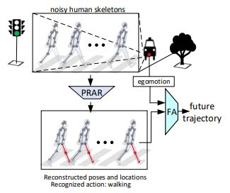

## Goal 

 - In this project, we study how pose features impact on human future location prediction. We strongly focus handling the scenarios that 
 the human pose estimation are often imperfect (e.g. missing detected human keypoints). 
 - The current method is based on spatio-temporal graph convolutional neural networks (st-gcnn), which we will exploit its capability to "attend" to visible human keypoints, 
 give higher importance weights to human parts that are related to prediction tasks. 

#### Results on JAAD dataset
**1. Generate train/val data**  
a. Read [PRE_PROCESS.md](PRE_PROCESS.md) for instructions extracting features.  
b. Generate/val data of JAAD and Kinetics for reconstruction task: 
```
$ python data_procesing/reconstruction/generate_data_jaad.py 
$ python data_procesing/reconstruction/generate_kinetics_jaad.py 
```   
c. Generate train/val data for prediction task with different observation types `obs_type`: `noisy`, `impute`, `gt` :  
```
$  python data_processing/prediction/generate_data_jaad.py --obs_type noisy
$  python data_processing/prediction/generate_data_jaad.py --obs_type impute
$  python data_processing/prediction/generate_data_jaad.py --obs_type gt
``` 
