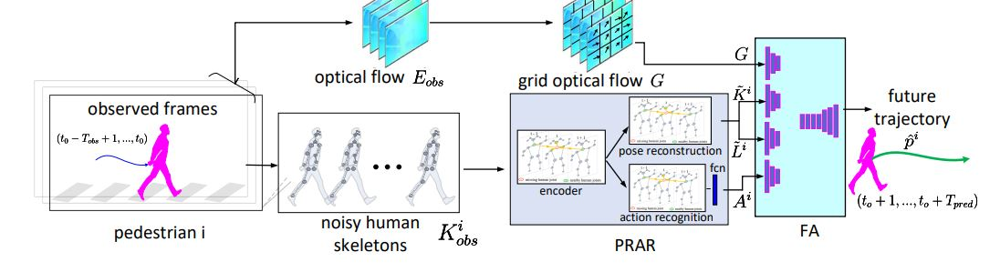

**Key ideas:
**
1. GPRAR is a graph convolutional network based pose reconstruction and action recognition for human trajectory prediction. 
2. GPRAR learns robust features: human poses and actions, under noisy scenarios. 
3. By design, GPRAR consists of two modules: PRAR (Pose Reconstruction and Action Recognition) and FA (Feature Aggregator).

Please cite and learn more at:
```
Huynh, Manh, and Gita Alaghband. "GPRAR: graph convolutional network based pose reconstruction and action recognition for human trajectory prediction." arXiv preprint arXiv:2103.14113 (2021). In Proceeding of BMVC 2021. 
```
https://arxiv.org/pdf/2103.14113.pdf




#### Experiments on JAAD dataset
**1. Generate train/val data**  
a. Read [PRE_PROCESS.md](PRE_PROCESS.md) for instructions extracting features.  
b. Generate/val data of JAAD and Kinetics for reconstruction task: 
```
$ python data_procesing/reconstruction/generate_data_jaad.py 
$ python data_procesing/reconstruction/generate_kinetics_jaad.py 
```   
c. Generate train/val data for prediction task with different observation types `obs_type`: `noisy`, `impute`, `gt` :  
```
$  python data_processing/prediction/generate_data_jaad.py --obs_type noisy
$  python data_processing/prediction/generate_data_jaad.py --obs_type impute
$  python data_processing/prediction/generate_data_jaad.py --obs_type gt
``` 
